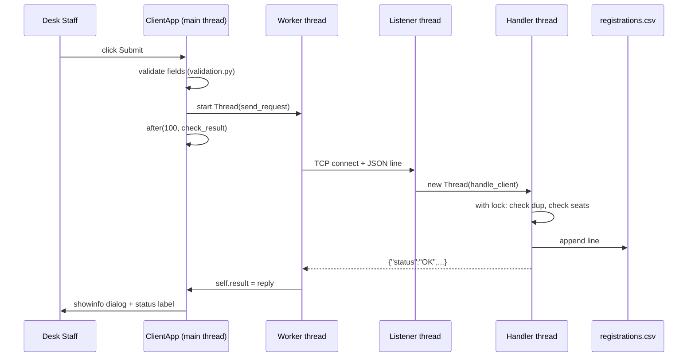

# System Design

## 1. Architecture at a Glance

```
 Desk 1  ClientApp  ──┐
 Desk 2  ClientApp  ──┼──  TCP :5050  ──►  RegistrationServer  ──►  data/registrations.csv
 Desk N  ClientApp  ──┘   (JSON lines)        │   ▲
                                              │   │  shared state guarded by ONE lock
                                              ▼   │
                                        ServerDashboard (Tkinter, polls every 500 ms)
```

Three layers, deliberately simple:

| Layer | Files | Job |
|---|---|---|
| Presentation | `client_gui.py`, `server_gui.py` | Tkinter windows, events, dialogs |
| Logic / Network | `server.py`, `client_net.py`, `validation.py` | Sockets, threads, lock, rules |
| Storage | `storage.py`, `data/registrations.csv` | Plain file read/append |
| Shared | `config.py` | Constants and flags |

The UI (frontend) is separated from data handling (backend), as promised in the proposal.

## 2. Process and Thread Model

### Server process (`python server_gui.py`)

| Thread | Created by | Runs | Daemon |
|---|---|---|---|
| **Main thread** | Python | Tkinter dashboard `mainloop()` and the `refresh()` poll | no |
| **Listener thread** | `start()` | `accept_loop()`: `accept()` new connections in a `while True` | yes |
| **Client handler thread** (one per connection) | listener | `handle_client()`: read request, process, send reply, close | yes |

Why daemon threads: when the dashboard window is closed, all background threads end automatically instead of keeping the program alive.

### Client process (`python client_gui.py`, many copies)

| Thread | Runs |
|---|---|
| **Main thread** | Tkinter `mainloop()`, all widget updates, all dialogs |
| **Worker thread** (one per click) | `send_request()`: connect, send, wait for reply, store in `self.result` |

### Shared server state (all inside `RegistrationServer`)

| Variable | Type | Meaning |
|---|---|---|
| `self.seats_left` | dict: course → int | Remaining seats |
| `self.roll_numbers` | set of str | Roll numbers already registered |
| `self.activity_log` | list of str | Lines shown on dashboard |
| `self.total_registered` | int | Total successful registrations |
| `self.lock` | `threading.Lock` | **One lock** guarding all the above and the file write |

One lock for everything is intentional: simplest to reason about and to explain.

## 3. Communication Protocol

- **Transport:** TCP (reliable, ordered). Server port from `config.PORT` (5050).
- **Pattern:** one request per connection. Client connects → sends one request → reads one reply → both close.
- **Encoding:** UTF-8 JSON text, one message, terminated by `"\n"`.
- **Size:** each message < 1 KB; read with `recv(BUFFER_SIZE)` where `BUFFER_SIZE = 4096`.
- **Timeout:** client sets `socket.settimeout(TIMEOUT)` (5 s) so it can never hang forever.

### Requests

**GET_COURSES**
```json
{"action": "GET_COURSES"}
```
Reply:
```json
{"status": "OK", "courses": {"CSE3011 Python Programming": 4, "CSE2001 Data Structures": 3}}
```
(values are *seats left*)

**REGISTER**
```json
{"action": "REGISTER", "name": "Asmi Chakne", "roll_number": "24BCE10354",
 "email": "asmi@example.com", "course": "CSE3011 Python Programming"}
```
Success reply:
```json
{"status": "OK", "message": "Registered 24BCE10354 in CSE3011 Python Programming", "seats_left": 3}
```
Error reply:
```json
{"status": "ERROR", "code": "FULL", "message": "No seats left in CSE3011 Python Programming"}
```

### Error codes

| Code | Meaning | Client shows |
|---|---|---|
| `INVALID` | A field failed validation | Warning dialog |
| `BAD_COURSE` | Course name not known to server | Warning dialog |
| `DUPLICATE` | Roll number already registered | Warning dialog |
| `FULL` | No seats left | Warning dialog |
| `BAD_REQUEST` | Unknown action / bad JSON | Error dialog |
| `SERVER` | File write failed or other server fault | Error dialog |
| `NETWORK` | *Created by the client* when connect/timeout fails | Error dialog |

## 4. Data Model and Storage

**File:** `data/registrations.csv` (created automatically; **no header row**).
**One line per registration**, five comma-separated fields:

```
roll_number,name,email,course,timestamp
24BCE10354,Asmi Chakne,asmi@example.com,CSE3011 Python Programming,2026-10-07 14:32:10
```

Why plain text with commas: it opens in Excel, and reading it is just `line.strip().split(",")`. Because of this, no field may contain a comma (validated).

**Startup load (`load_existing_data`)**: read every line; for each, add its roll number to `roll_numbers` and subtract one from `seats_left[course]`. This rebuilds the in-memory state, so a server restart loses nothing.

**Write order:** *file first, memory second.* If the file write fails, seats are not decremented, so memory and file never disagree.

## 5. The Race Condition and the Fix (core of the project)

### The bug (check-then-act)

Registering has two steps that must happen as one: **check** `seats_left > 0`, then **act** `seats_left -= 1`. If two threads interleave, both pass the check:

| Time | Thread A | Thread B | seats_left |
|---|---|---|---|
| t1 | reads seats = 1, 1 > 0 ✔ | | 1 |
| t2 | | reads seats = 1, 1 > 0 ✔ | 1 |
| t3 | seats = 1 − 1 | | 0 |
| t4 | | seats = 1 − 1 | **−1 (overbooked)** |

The same interleaving lets one roll number be registered twice.

### The fix: a mutual-exclusion lock

```python
def register(self, request):
    if USE_LOCK:
        with self.lock:                       # only ONE thread at a time in here
            return self.check_and_save(request)
    else:
        return self.check_and_save(request)   # unsafe, for the demo only
```

`check_and_save` does, in order: validate → course exists → duplicate roll? → seats left? → *(optional `time.sleep(DEMO_DELAY)`)* → append to file → decrement seats → add roll to set → log. Because the whole sequence runs inside the lock, a second thread must wait until the first has finished.

### Making the bug visible for the demo

`DEMO_DELAY = 0.2` puts a short sleep between the **check** and the **act**, which makes the overlap almost certain when several clients submit together. With `USE_LOCK = False` you will see overbooking; with `USE_LOCK = True` you will not.

### Locking rules
1. Hold the lock for as short a time as practical (but the file append stays inside it, so file and memory stay consistent).
2. `get_courses`, `get_snapshot` (dashboard) and `reset_data` also use `with self.lock:` so they never see half-updated data.
3. Never call a method that takes the lock from inside another locked section (a plain `Lock` is not re-entrant and would deadlock).

## 6. Key Flows

### 6.1 Registration (happy path)



### 6.2 Two desks, last seat

Desk A and Desk B submit at the same instant for a course with 1 seat. Two handler threads start; one acquires the lock first, books the seat; the other waits, then sees `seats_left == 0` and replies `FULL`. Exactly one succeeds.

### 6.3 Dashboard refresh

`ServerDashboard.refresh()` runs on the main thread every 500 ms via `root.after(500, self.refresh)`: it calls `server.get_snapshot()` (copy of data taken inside the lock), then updates labels and appends new log lines. Worker threads never touch the widgets.

### 6.4 Server startup

1. `ServerDashboard` builds the window.
2. User clicks **Start Server** → `RegistrationServer.start()`:
   - `ensure_data_file()` → `load_existing_data()`
   - create socket, `setsockopt(SO_REUSEADDR)`, `bind(("0.0.0.0", PORT))`, `listen()`
   - start the listener daemon thread.
3. Dashboard starts its `refresh()` loop.

## 7. Error Handling

| Situation | Where | Behaviour |
|---|---|---|
| Server not running / wrong IP | `client_net.send_request` | Returns `{"status":"ERROR","code":"NETWORK",...}` → error dialog |
| Reply takes > 5 s | `client_net` | `socket.timeout` caught → NETWORK error |
| Malformed JSON | `handle_client` | Reply `BAD_REQUEST`, server keeps running |
| Client disconnects mid-request | `handle_client` | `except OSError`: log and close, thread ends |
| File cannot be written | `check_and_save` | Reply `SERVER`; seats **not** decremented |
| Port already in use | `start()` | Dashboard shows error dialog |
| Empty/oversized/comma fields | `validation.py` (client and server) | `INVALID` with message |

Rule: catch **specific** exceptions (`OSError`, `ValueError`, `socket.timeout`), never a bare `except`.

## 8. Configuration (`config.py`)

| Constant | Default | Purpose |
|---|---|---|
| `HOST` | `"0.0.0.0"` | Server bind address (all interfaces) |
| `PORT` | `5050` | TCP port |
| `DEFAULT_SERVER_IP` | `"127.0.0.1"` | Pre-filled in client |
| `BUFFER_SIZE` | `4096` | `recv` size |
| `TIMEOUT` | `5` | Client socket timeout (s) |
| `DATA_FOLDER`, `DATA_FILE` | `"data"`, `"data/registrations.csv"` | Storage |
| `COURSES` | dict, e.g. `{"CSE3011 Python Programming": 5, "CSE2001 Data Structures": 3, "CSE2005 Database Systems": 4}` | Course → total seats |
| `USE_LOCK` | `True` | `False` only for race demo |
| `DEMO_DELAY` | `0.0` | Seconds to sleep between check and act (demo: `0.2`) |
| `REFRESH_MS` | `500` | Dashboard poll interval |
| Colours / fonts | see Design Document | Theme |

## 9. Deployment / Running Across Machines

1. Put the same project folder on every machine (same `config.py`).
2. Machine S runs `python server_gui.py` and clicks **Start Server**. Note its LAN IP (`ipconfig` / `ifconfig`).
3. Other machines run `python client_gui.py` and type S's IP in **Server IP**.
4. If it cannot connect: allow Python/port 5050 in the firewall; check all machines are on the same network (a phone hotspot works well for demos).

## 10. Security Notes (for honest viva answers)

Validated input (client and server), server never trusts the client, and fixed message size limits. **Not provided:** encryption, authentication, DoS protection. These would be future work (`ssl` module, login step).

## 11. Design Decisions Log

| Decision | Why |
|---|---|
| One request per connection | No message framing to explain; easiest to debug |
| JSON | Human-readable; `json.dumps` / `json.loads` are two easy calls |
| Plain `.csv` text via `open()` | Directly demonstrates Unit 4 file handling; no database to set up |
| One global lock | Simple mental model; fine for classroom scale |
| `after()` polling instead of cross-thread widget calls | Tkinter is not thread-safe; polling is the simplest safe pattern |
| Course names in `config.py` | Avoids rebuilding the dropdown dynamically (less code) |
| Plain `tk` widgets only (Frame, Label, Entry, Button, OptionMenu, Text, Scrollbar) | Matches the syllabus list; no `ttk` |
